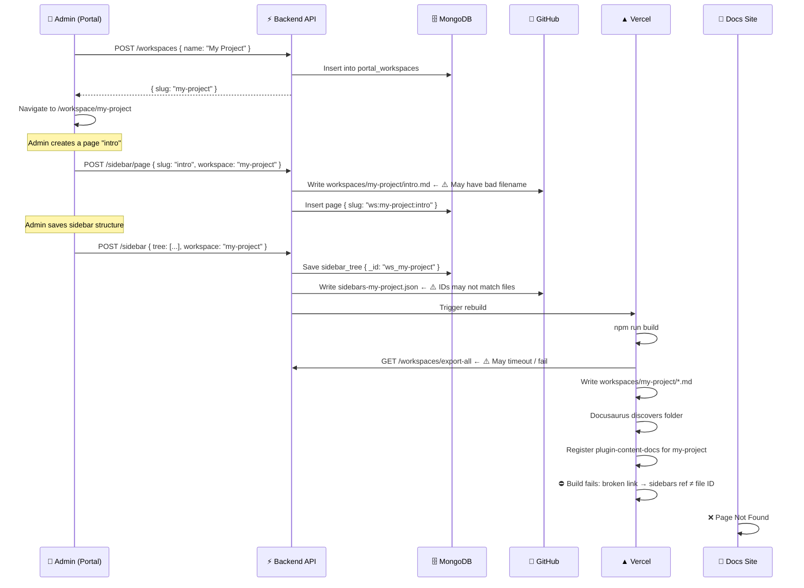
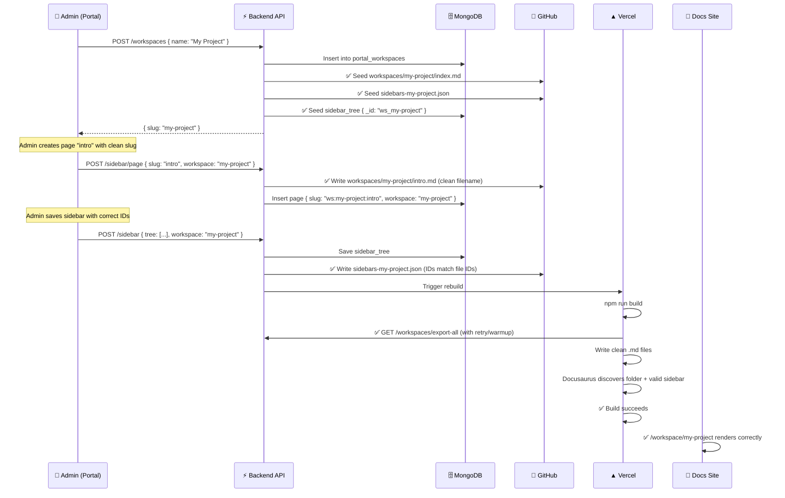

# 🏗️ Workspace Creation & Deployment — Technical Deep Dive

> **Delta Labs Docs — Internal Engineering Reference**
> Last updated: April 7, 2026 · Status: **Active Bug Analysis + Fix Guide**

---

## Table of Contents

- [1. System Architecture Overview](#1-system-architecture-overview)
- [2. How Workspace Creation Works (Portal Side)](#2-how-workspace-creation-works-portal-side)
  - [2.1 The UI Trigger — WorkspaceSwitcher](#21-the-ui-trigger--workspaceswitcher)
  - [2.2 The API Call — Backend Route](#22-the-api-call--backend-route)
  - [2.3 MongoDB Data Model](#23-mongodb-data-model)
  - [2.4 Sidebar Tree Initialization](#24-sidebar-tree-initialization)
  - [2.5 Page Creation Inside a Workspace](#25-page-creation-inside-a-workspace)
  - [2.6 Content Saving for Custom Workspaces](#26-content-saving-for-custom-workspaces)
- [3. How the Docs Site Discovers Workspaces](#3-how-the-docs-site-discovers-workspaces)
  - [3.1 The Sync Script — Bridge Between Worlds](#31-the-sync-script--bridge-between-worlds)
  - [3.2 Docusaurus Dynamic Plugin Discovery](#32-docusaurus-dynamic-plugin-discovery)
  - [3.3 The Sidebar JSON Contract](#33-the-sidebar-json-contract)
  - [3.4 The WorkspaceSwitcher on the Docs Site](#34-the-workspaceswitcher-on-the-docs-site)
- [4. 🐛 Root Cause Analysis — Why "Page Not Found"](#4--root-cause-analysis--why-page-not-found)
  - [4.1 Bug #1 — File Naming Mismatch (ws: prefix leak)](#41-bug-1--file-naming-mismatch-ws-prefix-leak)
  - [4.2 Bug #2 — Sidebar JSON doc ID ≠ actual file ID](#42-bug-2--sidebar-json-doc-id--actual-file-id)
  - [4.3 Bug #3 — Sync Script Not Wired Into Vercel Build](#43-bug-3--sync-script-not-wired-into-vercel-build)
  - [4.4 Bug #4 — `onBrokenLinks: 'throw'` Crashes the Build](#44-bug-4--onbrokenlinks-throw-crashes-the-build)
  - [4.5 Bug #5 — `list_all_docs()` Ignores Workspace Folders](#45-bug-5--list_all_docs-ignores-workspace-folders)
  - [4.6 Bug #6 — Workspace Folder May Not Exist in Git](#46-bug-6--workspace-folder-may-not-exist-in-git)
- [5. ✅ The Fix — Step-by-Step Resolution](#5--the-fix--step-by-step-resolution)
  - [5.1 Fix the File Naming in sidebar.py](#51-fix-the-file-naming-in-sidebarpy)
  - [5.2 Fix the Sidebar JSON Document IDs](#52-fix-the-sidebar-json-document-ids)
  - [5.3 Ensure Sync Script Runs at Build Time](#53-ensure-sync-script-runs-at-build-time)
  - [5.4 Relax Broken Link Behavior for Workspaces](#54-relax-broken-link-behavior-for-workspaces)
  - [5.5 Implement Workspace-Aware Valid Slug Resolution](#55-implement-workspace-aware-valid-slug-resolution)
  - [5.6 Seed Workspace Folder in GitHub on Creation](#56-seed-workspace-folder-in-github-on-creation)
- [6. Data Flow Diagrams](#6-data-flow-diagrams)
- [7. Verification Checklist](#7-verification-checklist)

---

## 1. System Architecture Overview

The Delta Labs Docs platform is a **three-tier architecture** where content management and rendering are decoupled by design:

```
┌──────────────────────┐     ┌───────────────────────┐     ┌────────────────────────┐
│   ADMIN PORTAL       │     │     BACKEND API        │     │     DOCS SITE          │
│   (Next.js 15)       │◄───►│     (FastAPI + Mongo)  │◄───►│     (Docusaurus 3.9)   │
│                      │     │                        │     │                        │
│ • WorkspaceSwitcher  │     │ • /workspaces CRUD     │     │ • Dynamic plugin       │
│ • DocsSidebar        │     │ • /sidebar tree ops    │     │   discovery            │
│ • RichEditor         │     │ • /pages CRUD          │     │ • Sync script at       │
│ • Content save       │     │ • /content save        │     │   build time           │
│                      │     │ • GitHub commit        │     │ • WorkspaceSwitcher    │
│ Hosted: Vercel       │     │ • Vercel rebuild hook  │     │   navbar item          │
│                      │     │ Hosted: Render         │     │ Hosted: Vercel         │
└──────────────────────┘     └───────────────────────┘     └────────────────────────┘
                                      │
                                      ▼
                          ┌───────────────────────┐
                          │     GITHUB REPO        │
                          │     (Single monorepo)  │
                          │                        │
                          │  docs-site/            │
                          │  ├── docs/         ← main workspace │
                          │  ├── workspaces/   ← custom workspaces│
                          │  │   └── {slug}/   ← one folder per ws│
                          │  ├── sidebars.ts   ← main sidebar      │
                          │  └── sidebars-{slug}.json ← ws sidebars│
                          └───────────────────────┘
```

### Key Principle

- **Main `docs` workspace** → files live in `docs-site/docs/`, sidebar in `sidebars.ts`
- **Custom workspaces** → files live in `docs-site/workspaces/{slug}/`, sidebar in `sidebars-{slug}.json`
- **Bridge** → A pre-build sync script (`sync-docs.ts`) fetches workspace data from the backend API and writes local `.md` files + sidebar JSON before Docusaurus builds

---

## 2. How Workspace Creation Works (Portal Side)

### 2.1 The UI Trigger — WorkspaceSwitcher

**File:** `portal/src/components/WorkspaceSwitcher.tsx`

The workspace creation is initiated from the **WorkspaceSwitcher** dropdown in the admin portal's navbar. When a user clicks **"+ Add Workspace"**:

```typescript
// portal/src/components/WorkspaceSwitcher.tsx — Line 153-168
const handleAddWorkspace = async () => {
  if (creating) return;
  setCreating(true);

  try {
    const result = await api.post<Workspace>('/workspaces', { name: 'New Workspace' });
    await fetchWorkspaces();                    // Refresh the list
    setOpen(false);
    setEditingId(null);
    router.push(`/workspace/${result.slug}`);   // Navigate to new workspace
  } catch (err) {
    console.error('Failed to create workspace:', err);
  } finally {
    setCreating(false);
  }
};
```

**What happens:**
1. POST to `/workspaces` with `{ name: "New Workspace" }`
2. Backend returns `{ id, name, slug, order, created_at, updated_at }`
3. Portal re-fetches all workspaces to sync the dropdown
4. User is navigated to `/workspace/{slug}` (the portal workspace editor)

### 2.2 The API Call — Backend Route

**File:** `backend/app/routes/workspaces.py`

```python
# Line 72-104
@router.post("/")
async def create_workspace(body: CreateWorkspaceBody, user=Depends(current_user)):
    """Create a new workspace, auto-generate slug, append to end of order list."""
    if not body.name.strip():
        raise HTTPException(400, "Workspace name cannot be empty")

    db = get_db()

    # Determine next order value
    last = await db.portal_workspaces.find_one(sort=[("order", -1)])
    next_order = (last["order"] + 1) if last and "order" in last else 0

    slug = _slugify(body.name)             # "New Workspace" → "new-workspace"
    slug = await _unique_slug(db, slug)    # Ensures no collision (e.g. "new-workspace-2")

    now = datetime.utcnow()
    doc = {
        "name": body.name.strip(),
        "slug": slug,
        "order": next_order,
        "created_at": now,
        "updated_at": now,
    }
    result = await db.portal_workspaces.insert_one(doc)

    return {
        "id": str(result.inserted_id),
        "name": doc["name"],
        "slug": doc["slug"],
        "order": doc["order"],
        ...
    }
```

**The `_slugify` algorithm:**
```python
def _slugify(name: str) -> str:
    slug = name.lower().strip()
    slug = re.sub(r'[^a-z0-9\s-]', '', slug)    # Strip special chars
    slug = re.sub(r'[\s]+', '-', slug)            # Spaces → hyphens
    slug = re.sub(r'-+', '-', slug)               # Collapse multiple hyphens
    slug = slug.strip('-')
    return slug or 'workspace'
```

### 2.3 MongoDB Data Model

Workspaces are stored in the **`portal_workspaces`** collection:

```json
{
  "_id": ObjectId("..."),
  "name": "New Workspace",
  "slug": "new-workspace",
  "order": 1,
  "created_at": ISODate("2026-04-07T18:00:00Z"),
  "updated_at": ISODate("2026-04-07T18:00:00Z")
}
```

> **Index:** A unique index on `slug` is ensured at startup in `main.py` → `_ensure_default_workspaces()`.

### 2.4 Sidebar Tree Initialization

When a workspace is first created, **no sidebar tree document exists**. The sidebar tree for each workspace is stored in the **`sidebar_tree`** collection with an `_id` convention:

| Workspace | `sidebar_tree._id` |
|-----------|---------------------|
| `docs` (main) | `"main"` |
| Custom `my-project` | `"ws_my-project"` |

The sidebar tree is **lazily created** — it only appears in MongoDB when the admin first adds a page or category via the portal's sidebar editor. When `GET /sidebar?workspace=my-project` returns `{ tree: [] }`, the portal shows an empty workspace with a prompt to create pages.

### 2.5 Page Creation Inside a Workspace

**File:** `backend/app/routes/sidebar.py` — `POST /sidebar/page`

When an admin creates a page within a custom workspace:

```python
# Line 253-311 (simplified)
@router.post("/page")
async def create_page(body, workspace="docs", db=..., current_user=...):
    slug = body.get("slug")

    # Strip any stacked workspace prefixes
    prefix = f"ws:{workspace}:"
    while slug and slug.startswith(prefix):
        slug = slug[len(prefix):]

    title = body.get("label", slug)

    # Write .md file to GitHub
    if workspace == "docs":
        file_path = f"docs-site/docs/{safe_slug}.md"
    else:
        file_path = f"docs-site/workspaces/{workspace}/{safe_slug}.md"  # ← Custom workspace path

    write_file(path=file_path, content=default_content, message=...)

    # Create MongoDB record
    db_slug = slug if workspace == "docs" else f"ws:{workspace}:{slug}"
    await db.pages.insert_one({
        "slug": db_slug,
        "workspace": workspace,
        "title": title,
        "content": f"# {title}\n\nStart writing here...",
        ...
    })
```

**Dual Storage Pattern:**
- 📁 **GitHub**: `docs-site/workspaces/{workspace-slug}/{page-slug}.md` — for Docusaurus to render
- 🗄️ **MongoDB**: `pages` collection with `slug: "ws:{workspace}:{page-slug}"` — for portal editing

### 2.6 Content Saving for Custom Workspaces

**File:** `backend/app/routes/content.py` — `POST /content/save`

```python
# Line 24-98
@router.post("/save")
async def save_content(request, db, current_user):
    workspace = request.workspace or "docs"

    # Clean slug — remove stacked prefixes
    prefix = f"ws:{workspace}:"
    clean_slug_val = slug
    while clean_slug_val.startswith(prefix):
        clean_slug_val = clean_slug_val[len(prefix):]

    db_slug = clean_slug_val if workspace == "docs" else f"ws:{workspace}:{clean_slug_val}"
    safe_slug = clean_slug_val.replace(":", "-")

    # GitHub path determination
    if workspace == "docs":
        file_path = f"docs-site/docs/{safe_slug}.md"
    else:
        file_path = f"docs-site/workspaces/{workspace}/{safe_slug}.md"

    # Write to GitHub + MongoDB
    write_file(path=file_path, content=file_content, message=...)
    await db.pages.update_one({"slug": db_slug}, {"$set": {...}}, upsert=True)
```

---

## 3. How the Docs Site Discovers Workspaces

### 3.1 The Sync Script — Bridge Between Worlds

**File:** `docs-site/scripts/sync-docs.ts`

This is the **critical bridge** between the dynamic MongoDB data and Docusaurus's static-site architecture. It runs as a **pre-build step**:

```json
// docs-site/package.json
{
  "scripts": {
    "prebuild:sync": "tsx scripts/sync-docs.ts",
    "build": "npm run prebuild:sync && docusaurus build",
    "start": "npm run prebuild:sync && docusaurus start"
  }
}
```

**What the sync script does:**

```
1. GET /workspaces/export-all ──► Backend returns ALL workspaces + pages + sidebars
2. for each workspace (skip "docs"):
   a. Create folder: workspaces/{slug}/
   b. Write each page as: workspaces/{slug}/{page-slug}.md (with frontmatter)
   c. Write sidebar as: sidebars-{slug}.json (Docusaurus format)
3. Docusaurus then builds with fresh content
```

The `export-all` endpoint on the backend (`/workspaces/export-all`) aggregates:
- All workspaces from `portal_workspaces`
- All pages for each workspace from `pages` collection
- Sidebar trees from `sidebar_tree` collection

### 3.2 Docusaurus Dynamic Plugin Discovery

**File:** `docs-site/docusaurus.config.ts` — Lines 5-27

```typescript
// 🌌 Workspace Discovery
const dynamicDocsPlugins: any[] = [];
const dynamicDocsPath = path.join(__dirname, 'workspaces');

if (fs.existsSync(dynamicDocsPath)) {
  const slugs = fs.readdirSync(dynamicDocsPath);
  slugs.forEach(slug => {
    const fullPath = path.join(dynamicDocsPath, slug);
    if (fs.statSync(fullPath).isDirectory()) {
      dynamicDocsPlugins.push([
        '@docusaurus/plugin-content-docs',
        {
          id: slug,                              // Unique plugin ID
          path: `workspaces/${slug}`,            // Content folder
          routeBasePath: `workspace/${slug}`,    // URL path
          sidebarPath: `./sidebars-${slug}.json` // Sidebar config
        }
      ]);
    }
  });
}
```

**This means:**
- For each folder inside `workspaces/`, Docusaurus registers a **separate `plugin-content-docs` instance**
- The URL for workspace pages becomes `/workspace/{slug}/{page-id}`
- Each workspace has its own isolated sidebar from `sidebars-{slug}.json`

### 3.3 The Sidebar JSON Contract

Each workspace's sidebar file must be a valid JSON file named `sidebars-{slug}.json` at the docs-site root, with a specific key format:

```json
{
  "sidebar_{slug}": [
    {
      "type": "category",
      "label": "Getting Started",
      "collapsible": true,
      "collapsed": false,
      "items": [
        {
          "type": "doc",
          "id": "my-page",        // ← MUST match the `id` in the .md frontmatter
          "label": "My Page"
        }
      ]
    }
  ]
}
```

> **Critical:** The `"id"` in the sidebar JSON **must exactly match** the `id` field in the corresponding `.md` file's YAML frontmatter. A mismatch = "Page Not Found".

### 3.4 The WorkspaceSwitcher on the Docs Site

**File:** `docs-site/src/theme/NavbarItem/WorkspaceSwitcherNavbarItem.tsx`

The docs-site has its own workspace switcher that:
1. Fetches `/workspaces` from the backend API at runtime
2. Determines current workspace from the URL (`/workspace/{slug}` → extract slug)
3. Uses `history.push()` to navigate between workspaces

```typescript
const handleSelect = (slug: string) => {
  setIsOpen(false);
  if (slug === 'docs') {
    history.push('/');           // Main docs at root
  } else {
    history.push(`/workspace/${slug}`);  // Custom workspace
  }
};
```

This is registered as a custom navbar item type via:
```typescript
// docs-site/src/theme/NavbarItem/ComponentTypes.tsx
export default {
  ...ComponentTypes,
  'custom-WorkspaceSwitcher': WorkspaceSwitcher,
};
```

---

## 4. 🐛 Root Cause Analysis — Why "Page Not Found"

When a new workspace is created, pages are added, content is saved, and the Vercel build completes — but navigating to `/workspace/{slug}` on the live docs site shows **"Page Not Found"**. Here's why:

### 4.1 Bug #1 — File Naming Mismatch (ws: prefix leak)

**Severity:** 🔴 Critical

**Location:** `backend/app/routes/sidebar.py` — `create_page()` (Line 284-289)

When a page is created in a custom workspace, the `.md` file written to GitHub gets a **polluted filename**:

```python
safe_slug = slug.replace(":", "-")
# If slug = "ws:my-project:intro" after incomplete cleaning:
# safe_slug = "ws-my-project-intro"
# file_path = "docs-site/workspaces/my-project/ws-my-project-intro.md"  ← WRONG
```

But the sidebar JSON references the doc ID as `"intro"`. Docusaurus expects a file at `workspaces/my-project/intro.md`, but finds `ws-my-project-intro.md` instead → **broken link → Page Not Found**.

**Evidence from existing data:**
```
workspaces/folder-structure/ws-folder-structure-page.md  ← BAD: has "ws-folder-structure-" prefix
```

The file content confirms the pollution:
```yaml
---
title: Ws:Folder Structure:Page      # ← Title also has ws: prefix
sidebar_label: Ws:Folder Structure:Page
---
```

### 4.2 Bug #2 — Sidebar JSON doc ID ≠ actual file ID

**Severity:** 🔴 Critical

**Location:** `backend/app/routes/sidebar.py` — `save_sidebar()` (Lines 218-237)

When saving the sidebar tree for a custom workspace, the backend generates `sidebars-{slug}.json` and pushes it to GitHub. However, the `transform_node_for_docusaurus()` function is called **without valid slugs** (`None`):

```python
# Line 226
transformed_items = [
    transformed for transformed in (
        transform_node_for_docusaurus(n, None)  # ← valid_slugs=None
        for n in (clean_tree or [])
    )
    if transformed is not None
]
```

Because `valid_slugs=None`, the `find_best_slug()` function inside `transform_node_for_docusaurus()` simply returns whatever slug is in the tree node **without validation**. This means:

- If the sidebar tree node has `slug: "page"` but the actual file on disk is `ws-folder-structure-page.md` (with frontmatter `id: page`), there's a potential mismatch
- No cross-check ensures that the `id` in the sidebar JSON actually maps to an existing file

### 4.3 Bug #3 — Sync Script Not Wired Into Vercel Build

**Severity:** 🔴 Critical

**Location:** `docs-site/package.json` (Lines 7-9) + `docs-site/vercel.json`

The sync script **IS wired** via the `build` script:
```json
"build": "npm run prebuild:sync && docusaurus build"
```

And `vercel.json` uses:
```json
"buildCommand": "npm run build"
```

**However**, the sync script fetches from:
```typescript
const API_URL = process.env.API_URL || 'https://delta-labs-backend.onrender.com';
```

If the `API_URL` environment variable is **not set in Vercel's environment settings**, OR if the Render-hosted backend is on a cold start / sleeping when Vercel's build triggers, the `fetch()` call will fail, and **the entire sync is skipped** (process exits with code 1):

```typescript
} catch (error) {
    console.error('\n❌ Sync failed:', error);
    process.exit(1);  // ← This ABORTS the entire build
}
```

If `process.exit(1)` fires, the `&&` chain in the build command prevents `docusaurus build` from running at all. But even if the sync partially succeeds — if export-all returns incomplete data (e.g., the new workspace was just created and has no pages yet), the `workspaces/` folder may end up empty.

### 4.4 Bug #4 — `onBrokenLinks: 'throw'` Crashes the Build

**Severity:** 🟡 Medium

**Location:** `docs-site/docusaurus.config.ts` — Line 34

```typescript
onBrokenLinks: 'throw',
```

If **any** doc ID referenced in a sidebar JSON doesn't match an actual `.md` file, Docusaurus **throws an error and fails the entire build**. This means even one misconfigured workspace can take down ALL workspaces on the docs site.

### 4.5 Bug #5 — `list_all_docs()` Ignores Workspace Folders

**Severity:** 🟡 Medium

**Location:** `backend/app/github_client.py` — `list_all_docs()` (Lines 199-223)

```python
def list_all_docs() -> list[str]:
    docs_path = settings.DOCS_FOLDER  # = "docs-site/docs"
    # Only scans docs-site/docs/ — completely ignores docs-site/workspaces/!
```

This function is used for slug validation when saving the main sidebar. For custom workspaces, the code passes `valid_slugs=None` entirely (Line 226 of sidebar.py). This means:
- No validation that pages referenced in custom workspace sidebars actually exist in GitHub
- Ghost entries can persist in sidebars after page deletion

### 4.6 Bug #6 — Workspace Folder May Not Exist in Git

**Severity:** 🟠 High

**Location:** `backend/app/routes/workspaces.py` — `create_workspace()`

When a workspace is created via `POST /workspaces`, the backend:
1. ✅ Creates a `portal_workspaces` MongoDB document
2. ❌ Does NOT create a `workspaces/{slug}/` folder in GitHub
3. ❌ Does NOT create a `sidebars-{slug}.json` file in GitHub

The workspace folder in GitHub only comes into existence when:
- A page is created → `write_file(path=f"docs-site/workspaces/{slug}/{safe_slug}.md", ...)`
- The sidebar is saved → `write_file(path=f"sidebars-{slug}.json", ...)`

**But** if a Vercel rebuild is triggered before any pages are created, the sync script will:
1. Call `/workspaces/export-all`
2. Get the workspace with an empty pages array
3. Create an empty `workspaces/{slug}/` directory locally
4. Create a `sidebars-{slug}.json` with an empty array
5. Docusaurus discovers the folder → registers a `plugin-content-docs` instance
6. But the folder is empty → plugin initializes with **zero documents**
7. Any navigation to `/workspace/{slug}` → **404 Page Not Found**

---

## 5. ✅ The Fix — Step-by-Step Resolution

### 5.1 Fix the File Naming in sidebar.py

**Problem:** The `create_page()` function may still have leftover `ws:` prefix in the slug when creating the `.md` file.

**Fix in `backend/app/routes/sidebar.py`:**

```python
@router.post("/page")
async def create_page(body, workspace="docs", db=..., current_user=...):
    slug = body.get("slug")

    # Robust cleaning: remove ALL stacked workspace prefixes
    prefix = f"ws:{workspace}:"
    while slug and slug.startswith(prefix):
        slug = slug[len(prefix):]

    title = body.get("label", slug)
    safe_slug = slug.replace(":", "-")   # ← Now slug is clean BEFORE making safe

    # This should now produce clean paths:
    # docs-site/workspaces/my-project/intro.md  ← CORRECT
    if workspace == "docs":
        file_path = f"docs-site/docs/{safe_slug}.md"
    else:
        file_path = f"docs-site/workspaces/{workspace}/{safe_slug}.md"
```

**Also fix the default content frontmatter:**

```python
default_content = f"""---
title: {title}
sidebar_label: {title}
id: {safe_slug}
---

# {title}

Start writing here...
"""
```

> **The `id` field in the frontmatter MUST match the `id` used in `sidebars-{slug}.json`.**

### 5.2 Fix the Sidebar JSON Document IDs

**Problem:** The sidebar JSON's `id` field may not match the actual file's `id` frontmatter field.

**Fix in `backend/app/routes/sidebar.py` — `save_sidebar()`:**

The ID used in the sidebar JSON for a custom workspace must be the **clean page slug only** (no `ws:` prefix, no workspace prefix):

```python
# When building sidebar JSON for custom workspaces:
transformed_items = [
    transformed for transformed in (
        transform_node_for_docusaurus(n, None) for n in (clean_tree or [])
    )
    if transformed is not None
]
```

The `sanitize_tree()` function (Line 32-41) already strips `ws:workspace:` prefixes from slugs in the tree. **Verify** that the resulting slug in the sidebar JSON matches the filename:

```
Sidebar JSON: { "type": "doc", "id": "intro", "label": "Introduction" }
                                      ↕ must match
File:         workspaces/my-project/intro.md (with frontmatter id: intro)
```

### 5.3 Ensure Sync Script Runs at Build Time

**Problem:** The sync script may fail silently or crash the build.

**Fix 1 — Add `API_URL` to Vercel environment variables:**

```
Vercel Dashboard → Project Settings → Environment Variables
  Name:  API_URL
  Value: https://delta-labs-backend.onrender.com
```

**Fix 2 — Make the sync script failure-tolerant:**

```typescript
// docs-site/scripts/sync-docs.ts
async function sync() {
  try {
    const response = await fetch(`${API_URL}/workspaces/export-all`);
    if (!response.ok) throw new Error(`API fetch failed: ${response.statusText}`);
    // ... process data ...
  } catch (error) {
    console.error('\n⚠️ Sync failed (non-fatal):', error);
    // DON'T process.exit(1) — let Docusaurus build with whatever exists in Git
    console.log('Building with existing workspace data from Git...');
  }
}
```

**Fix 3 — Add a wake-up ping before the sync:**

Render free-tier backends sleep after 15 minutes of inactivity. Add a warm-up:

```typescript
async function sync() {
  // Wake up the backend (Render cold start can take 30-60s)
  console.log('🔄 Waking up backend...');
  try {
    await fetch(`${API_URL}/`, { signal: AbortSignal.timeout(60000) });
  } catch { /* ignore timeout */ }

  // Now fetch workspace data
  const response = await fetch(`${API_URL}/workspaces/export-all`);
  // ...
}
```

### 5.4 Relax Broken Link Behavior for Workspaces

**Problem:** One broken workspace link crashes the entire build.

**Fix in `docs-site/docusaurus.config.ts`:**

```typescript
const config: Config = {
  // ...
  onBrokenLinks: 'warn',    // Changed from 'throw' to 'warn'
  // ...
};
```

This ensures a misconfigured workspace doesn't prevent the entire docs site from deploying.

### 5.5 Implement Workspace-Aware Valid Slug Resolution

**Problem:** `list_all_docs()` only scans `docs-site/docs/`.

**Fix — Add a `list_workspace_docs()` function in `backend/app/github_client.py`:**

```python
def list_workspace_docs(workspace_slug: str) -> list[str]:
    """
    Returns all .md file slugs in a specific workspace folder.
    """
    try:
        repo = get_repo()
        ws_path = f"docs-site/workspaces/{workspace_slug}"
        all_files = []
        try:
            contents = repo.get_contents(ws_path)
        except GithubException:
            return []  # Folder doesn't exist yet

        while contents:
            file_content = contents.pop(0)
            if file_content.type == "dir":
                contents.extend(repo.get_contents(file_content.path))
            elif file_content.path.endswith(".md"):
                rel_path = file_content.path[len(ws_path):].lstrip("/")
                slug = rel_path[:-3]
                all_files.append(slug)
        return all_files
    except Exception as e:
        logger.error(f"Error listing workspace docs: {e}")
        return []
```

**Then update `save_sidebar()` in `sidebar.py`:**

```python
# For custom workspaces — use workspace-specific valid slugs
from app.github_client import list_workspace_docs
valid_slugs = list_workspace_docs(workspace)
transformed_items = [
    transformed for transformed in (
        transform_node_for_docusaurus(n, valid_slugs) for n in (clean_tree or [])
    )
    if transformed is not None
]
```

### 5.6 Seed Workspace Folder in GitHub on Creation

**Problem:** Creating a workspace doesn't create the folder in GitHub.

**Fix — Update `create_workspace()` in `backend/app/routes/workspaces.py`:**

```python
@router.post("/")
async def create_workspace(body: CreateWorkspaceBody, user=Depends(current_user)):
    # ... existing workspace creation logic ...

    # Seed the workspace folder and sidebar in GitHub
    from app.github_client import write_file

    # 1. Create a placeholder .md file so the folder exists
    placeholder_content = f"""---
title: Welcome to {body.name.strip()}
sidebar_label: Welcome
id: index
---

# Welcome to {body.name.strip()}

This workspace has been created. Start adding pages!
"""
    write_file(
        path=f"docs-site/workspaces/{slug}/index.md",
        content=placeholder_content,
        message=f"feat: initialize workspace '{body.name.strip()}'"
    )

    # 2. Create the sidebar JSON
    import json
    initial_sidebar = {
        f"sidebar_{slug}": [
            {"type": "doc", "id": "index", "label": "Welcome"}
        ]
    }
    write_file(
        path=f"docs-site/sidebars-{slug}.json",
        content=json.dumps(initial_sidebar, indent=2),
        message=f"feat: initialize sidebar for '{body.name.strip()}'"
    )

    # 3. Also initialize the sidebar tree in MongoDB
    await db.sidebar_tree.update_one(
        {"_id": f"ws_{slug}"},
        {"$set": {
            "tree": [{"type": "page", "slug": "index", "label": "Welcome"}],
            "updated_at": now.isoformat(),
            "updated_by": user.get("name", "system"),
        }},
        upsert=True
    )

    return { ... }
```

---

## 6. Data Flow Diagrams

### Workspace Creation → Deployment Flow (Current — Broken)



### Workspace Creation → Deployment Flow (Fixed)



---

## 7. Verification Checklist

After applying all fixes, verify each step:

### Backend Verification
- [ ] Create a new workspace → check that `workspaces/{slug}/index.md` exists in GitHub
- [ ] Create a new workspace → check that `sidebars-{slug}.json` exists in GitHub
- [ ] Create a page in workspace → verify `.md` filename has **no** `ws-` prefix
- [ ] Save sidebar → verify `sidebars-{slug}.json` doc IDs match `.md` file `id` frontmatter
- [ ] MongoDB `sidebar_tree` document has `_id: "ws_{slug}"`
- [ ] MongoDB pages have `workspace: "{slug}"` field

### Sync Script Verification
- [ ] `API_URL` environment variable is set in Vercel project settings
- [ ] Sync script handles backend timeout gracefully (no `process.exit(1)`)
- [ ] Sync script output shows workspace being processed

### Docusaurus Build Verification
- [ ] `onBrokenLinks` is set to `'warn'` (not `'throw'`)
- [ ] `workspaces/{slug}/` folder is created during build
- [ ] `sidebars-{slug}.json` sidebar IDs all resolve to existing `.md` files
- [ ] Workspace pages are accessible at `/workspace/{slug}/{page-id}`

### Live Site Verification
- [ ] WorkspaceSwitcher dropdown shows the new workspace
- [ ] Clicking the workspace navigates to `/workspace/{slug}`
- [ ] Workspace pages render content correctly
- [ ] Sidebar navigation within the workspace works

---

## Quick Reference — Key File Locations

| Component | File | Purpose |
|-----------|------|---------|
| Workspace CRUD API | `backend/app/routes/workspaces.py` | Create, rename, delete, export workspaces |
| Sidebar Management | `backend/app/routes/sidebar.py` | Sidebar tree CRUD, page creation, GitHub sync |
| Content Save | `backend/app/routes/content.py` | Save page content to MongoDB + GitHub |
| GitHub Client | `backend/app/github_client.py` | Read/write files, trigger rebuilds |
| Backend Config | `backend/app/config.py` | Environment variables & settings |
| Sync Script | `docs-site/scripts/sync-docs.ts` | Pre-build data sync from API to filesystem |
| Docusaurus Config | `docs-site/docusaurus.config.ts` | Dynamic workspace plugin registration |
| Main Sidebar | `docs-site/sidebars.ts` | Main "docs" workspace sidebar |
| Workspace Sidebar | `docs-site/sidebars-{slug}.json` | Per-workspace sidebar configs |
| Workspace Content | `docs-site/workspaces/{slug}/*.md` | Markdown files for custom workspaces |
| Portal Switcher | `portal/src/components/WorkspaceSwitcher.tsx` | Admin workspace dropdown + CRUD UI |
| Docs-Site Switcher | `docs-site/src/theme/NavbarItem/WorkspaceSwitcherNavbarItem.tsx` | Reader-facing workspace switcher |
| Navbar Registration | `docs-site/src/theme/NavbarItem/ComponentTypes.tsx` | Maps custom navbar type to component |

---

> **TL;DR:** New workspaces show "Page Not Found" because of a chain of 6 bugs: file naming pollution from `ws:` prefixes, sidebar JSON IDs not matching actual file IDs, missing workspace folder seeding in GitHub, no sync script error tolerance, aggressive `onBrokenLinks: 'throw'` config, and `list_all_docs()` ignoring workspace folders. Fix all 6 for reliable workspace deployment.
