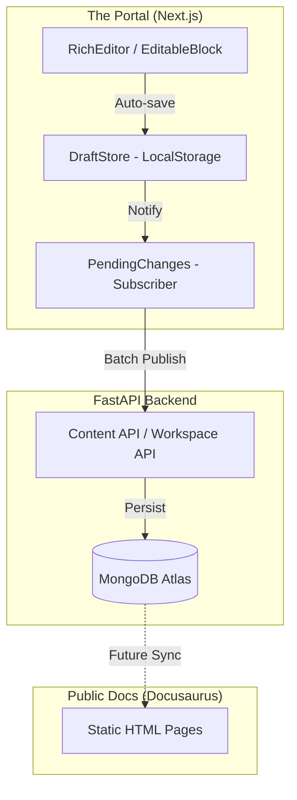

# 🌌 Delta Labs: Dynamic Workspace Architecture

> **Internal Briefing for AI Agents & Developers**
> This document outlines the transition of the Delta Labs documentation ecosystem from a single-instance static site to a high-scale, multi-workspace dynamic CMS.

---

## 🏗️ System Overview

The Delta Labs documentation ecosystem is split into three distinct layers:

1.  **FastAPI Backend**: The "Source of Truth" managing MongoDB collections for pages, workspaces, and audit logs.
2.  **The Portal (Next.js)**: The administrative "Command Center" where content is drafted, workspaces are managed, and changes are reviewed.
3.  **The Docs Site (Docusaurus)**: The "Public Interface" optimized for speed and SEO, currently rendering only the core documentation.

---

## ⚡ The "Custom Workspace" Breakthrough

We have recently evolved the system from a single `/docs` route into a **Dynamic Workspace Manager**. This allows admins to create separate "bubbles" of content for different departments or projects (e.g., *IT-Ops*, *Investment*, *Marketing*).

### Key Implementation Details:
*   **Namespacing**: Every draft in the browser's `localStorage` is isolated by `workspaceSlug`. A change in the "Equity" workspace will never overwrite a change in the "Docs" workspace.
*   **Isolated State Management**: The `draftStore.ts` and `pendingChanges.ts` libraries are workspace-aware.
*   **Dynamic Routing**: The Portal now handles dynamic paths like `/workspace/[slug]/[...subslug]` to render real-time previews and editors for custom workspaces.

---

## 🔄 Data Flow Architecture



---

## 🚧 Current Paradox: Portal vs. Docs Site

As of now, the system exists in two different states of evolution:

| Feature | The Portal (Admin) | The Docs Site (Public) |
| :--- | :--- | :--- |
| **Workspace Selector** | ✅ Fully Functional (with Rename/Delete) | ❌ Missing (Statically Configured) |
| **Real-time Editing** | ✅ Supported (Drafting Engine) | ❌ N/A (Static Views) |
| **Custom Workspaces** | ✅ Supported via API Routing | ❌ Hidden (Only `/docs` exists) |
| **Data Source** | Database (FastAPI) | Local Files (`docs/` folder) |

### Why the Gap?
The Portal is a **Dynamic App** that queries the database on every page load. The Docs Site is a **Static Site Generator (SSG)** that only knows about the files in its repository. For a custom workspace to appear on the public site, it must first be "synced" into a file format that Docusaurus understands.

---

## 🎯 The Next Strategic Goal: The Automated Sync Pipeline

We aim to create an automated bridge that turns database rows into public documentation.

### The Vision:
1.  **Triggered Rebuild**: When an admin hits "Deploy" in the Portal, the backend triggers a Vercel build.
## 🛠️ Step-by-Step Implementation Blueprint

To enable multi-workspace support on the public Docs site, execute these stages in order:

### Stage 1: Backend Data Export
The FastAPI backend (`backend/main.py`) must provide a bulk export endpoint for the static builder.
*   **Endpoint**: `GET /workspace/export-all`
*   **Payload**: Returns a JSON object where keys are workspace slugs and values contain the full page content (`content`, `slug`, `sidebar_position`, `category`) and the hierarchical `sidebar_tree`.

### Stage 2: The Node.js Sync Script
Create `docs-site/scripts/sync-docs.ts` to transform the DB into a filesystem.
```typescript
// Logic Flow:
// 1. Fetch from /workspace/export-all
// 2. Iterate through each workspace
// 3. Create folder: ./docs-site/dynamic_docs/[workspace-slug]
// 4. Save each page as [slug].md inside the folder
// 5. Generate sidebars-[workspace-slug].json based on the DB tree
```
*   **Environment**: Must be executed in the `prebuild` hook of `package.json`.

### Stage 3: Dynamic Docusaurus Config
Update `docs-site/docusaurus.config.ts` to automatically detect dynamic docs.
```typescript
const dynamicDocsPlugins = fs.readdirSync('./dynamic_docs').map(slug => ([
  '@docusaurus/plugin-content-docs',
  {
    id: slug,
    path: `dynamic_docs/${slug}`,
    routeBasePath: `workspace/${slug}`,
    sidebarPath: `./sidebars-${slug}.json`,
  }
]));

const config: Config = {
  // ... core config
  plugins: [...dynamicDocsPlugins],
};
```

### Stage 4: Client-Side Navbar Switcher (React Swizzle)
The default Docusaurus navbar is static. We must "swizzle" the `NavbarItem` to include a dynamic dropdown.
*   **Component**: `src/theme/NavbarItem/WorkspaceSwitcher.tsx`
*   **State**: Fetch the `/workspaces` list on mount from the production API.
*   **Logic**: If the user selects "Marketing", route them to `window.location.origin + "/workspace/marketing"`.

### Stage 5: Deployment Automation
Update the **Portal**'s "Publish" button to trigger the production rebuild.
1. Admin hits `Publish` in the Portal.
2. Portal sends `POST /trigger-rebuild` to FastAPI.
3. FastAPI triggers a **Vercel Deployment Hook**.
4. Vercel runs `npm run prebuild:sync && docusaurus build`.
5. The latest DB content is frozen into static files.

---

## 🤖 Guide for the Next AI Agent

When you are tasked with starting this, focus on **Stage 2** first (the sync script). You will need to ensure that the Mermaid diagram in this file remains the source of truth for the architectural flow. 

**Critical Warning**: Ensure that the sync script handles "slug collisions". If a custom workspace has a page with the same slug as another workspace, they must be safely isolated in their respective `dynamic_docs/` subdirectories.
